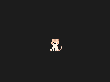

# Pedro the Cat 🐱

A cute VS Code extension that adds an animated pixel art cat to your editor to keep you company while coding!



## Features

- 🐱 An adorable pixel art cat named Pedro
- 🎨 Automatically adapts to your editor theme
- ✨ Smooth tail animation
- 🖼️ Displays in a small panel on the right side of your editor

## Installation

1. Open VS Code
2. Press `Cmd+P` (Mac) or `Ctrl+P` (Windows/Linux)
3. Paste: `ext install pedro-with-me`
4. Press Enter

## Usage

1. Press `Cmd+Shift+P` (Mac) or `Ctrl+Shift+P` (Windows/Linux)
2. Type "Show Pedro the Cat"
3. Press Enter
4. Pedro will appear in a small panel on the right side of your editor!

## Development

```bash
# Clone the project
git clone https://github.com/corolanvirus/pedro-with-me.git
cd pedro-with-me

# Install dependencies
npm install

# Compile
npm run compile

# Launch in development mode
F5 in VS Code
```

## Why Pedro?

Because every developer deserves a cute companion! Pedro is a pixel art cat that lives in your editor and keeps you company while you code. He's perfect for:

- 💻 Long coding sessions
- 🎯 Adding a touch of fun to your workspace
- 🌙 Those late-night debugging sessions
- 🎮 Pixel art lovers

## Contributing

Contributions are welcome! Feel free to:

- 🐛 Report bugs
- 💡 Suggest new features
- 🎨 Submit pixel art variations
- 🔧 Submit pull requests

## Credits

- Cat sprites lovingly created in pixel art
- Inspired by cats keeping developers company worldwide 🌍
- Special thanks to the VS Code extension community

## License

MIT - See the [LICENSE](LICENSE) file for details.

---

Made with ❤️ by [corolanvirus](https://github.com/corolanvirus) for cat-loving coders
